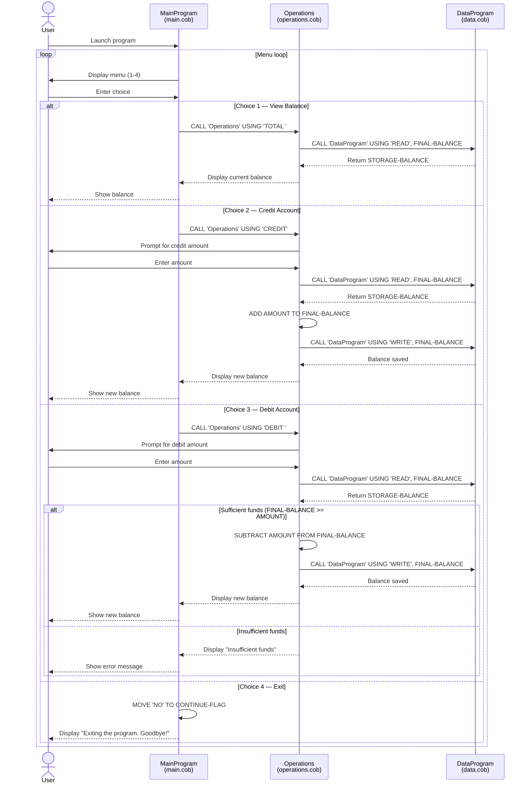

# Legacy COBOL Codebase Documentation

## Overview

This codebase implements a student account management system written in COBOL. It provides a menu-driven interface for viewing balances and performing credit/debit transactions on a student account.

---

## File Descriptions

### `src/cobol/main.cob` — Entry Point (`MainProgram`)

The main program and application entry point. It presents a text-based menu to the user and dispatches to the appropriate operation based on input.

**Key logic:**
- Loops continuously until the user selects "Exit" (option 4).
- Accepts a single-digit choice (1–4) from the user.
- Delegates all account operations to `Operations` via `CALL 'Operations' USING <operation-code>`.

**Menu options:**

| Choice | Action          | Operation code passed |
|--------|-----------------|-----------------------|
| 1      | View Balance    | `TOTAL `              |
| 2      | Credit Account  | `CREDIT`              |
| 3      | Debit Account   | `DEBIT `              |
| 4      | Exit            | —                     |

---

### `src/cobol/operations.cob` — Business Logic (`Operations`)

Handles the three account operations. Called by `MainProgram` with a 6-character operation code.

**Key functions:**

| Operation | Description |
|-----------|-------------|
| `TOTAL `  | Reads the current balance from `DataProgram` and displays it. |
| `CREDIT`  | Prompts for an amount, reads the current balance, adds the amount, and writes the new balance back. |
| `DEBIT `  | Prompts for an amount, reads the current balance, checks for sufficient funds, subtracts the amount if possible, and writes the new balance back. |

**Business rules:**
- A debit transaction is only executed when `FINAL-BALANCE >= AMOUNT`. If funds are insufficient, the transaction is rejected with the message `"Insufficient funds for this debit."` and the balance remains unchanged.
- Credit transactions have no upper limit.
- The initial in-memory balance is set to `1000.00` at program start.

---

### `src/cobol/data.cob` — Data Access Layer (`DataProgram`)

Manages in-memory storage of the account balance. Acts as a simple data access layer called by `Operations`.

**Key functions:**

| Operation code | Description |
|----------------|-------------|
| `READ`         | Copies the internal `STORAGE-BALANCE` value into the `BALANCE` linkage field for the caller. |
| `WRITE`        | Copies the caller-supplied `BALANCE` value into `STORAGE-BALANCE`, persisting it for the session. |

**Notes:**
- Balance is stored in `STORAGE-BALANCE PIC 9(6)V99` — a packed decimal supporting up to 999999.99.
- The initial balance defaults to `1000.00` at program load.
- There is no file or database persistence; all data is held in working storage and is lost when the program exits.

---

## Business Rules Summary

1. **Initial balance:** Every program run starts with a balance of `1000.00`.
2. **Overdraft protection:** Debit operations are blocked when the requested amount exceeds the current balance.
3. **No persistence:** Account state is in-memory only and resets on each program execution.
4. **Operation codes are 6 characters:** Codes such as `TOTAL ` and `DEBIT ` include trailing spaces to match the `PIC X(6)` field definition.

---

## Program Call Hierarchy

```
MainProgram (main.cob)
└── Operations (operations.cob)
    └── DataProgram (data.cob)
```

---

## Data Flow Sequence Diagram


